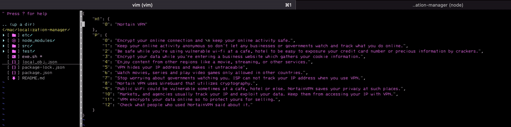

## Localization Manager
This repository helps users to make localized json file(to 102 countries language based on google translator API) from a json file.

The countries available for localization are listed in `./src/lang_code.js`. You can decide which countries you want to translate in the file by adding countries of `langsExplain`object to `langsToTranslate` array in `./src/edit-lang-coverage.js`. The countries list is referenced [here](https://github.com/shikar/NODE_GOOGLE_TRANSLATE/blob/master/languages.js). 

### Environment
- Linux like OS
- Node.js

This repo is only working on Linux os based machine. On Windows with terminal it may not work because some bash commands will not work on Windows OS which don't have. Node.js should be installed before to run. 

### Setup repository
After download this repository, in the directory node modules should be installed. Type

```

npm install

```

### Quick Start
- Install node modules by typing `npm install` at the repository directory `./`. 
- Open `./src/lang_code.js` and `./src/edit-lang-coverage.js`. Add countries to the `langsToTranslate` array in `./src/edit-lang-coverage.js` from the `langsExplain` object at `./src/lang_code.js`. The countries within `langsToTranslate` array will be the countries you want to target for translating. Leaving `langsToTranslate` empty will translate to every langauge by default.
- Then execute `exe.sh <json_file_you_to_localize>` file by typing `./exe.sh test.json` at the repositories `./` directory on terminal.

Here is already an example .json file, so we can execute translating without preparing .json file. `local_obj.json` is an example json file to test the repository. Type for example,

```

./exe local_obj.json

```

### Example adding countries to `langsToTranslate` array in `./src/edit-lang-coverage.js` 
 The file is at `./src`. You can add,

```js

// ./src/edit-lang-coverage.js 

const langsToTranslate = [langsExplain.fr, langsExplain.ko /*add more languages from langsExplain here*/]

```

or you can leave `langsToTranslate` empty to translate all langauges,

```js

// ./src/edit-lang-coverage.js 

const langsToTranslate = []

```


### Localize multiple json file
You can localize multiple josn files. 

- Execute `exe.sh <json_file_you_to_localize1> <json_file_you_to_localize2>` file by typing `./exe.sh test1.json test2.json` on current directory on terminal.

### Localize json files which contains html tags
It localize texts without html tag files. Also texts inside of more than 2 tags can be localized. 

## Briefing about how the program works
Short briefing orders the program executed.

1. Command takes into `exe.sh`. `exe.sh` execute `index.js` file. 
- ex) `./exe.sh local_obj.json`
2. .json file is parsed at `index.js`. Parsed json is like,
`{"key": {"key1": "value"}}`
3. Each key and object is deep copied into `srcObj` by `addStr` function to scan what to regex.
4. With the object at 3, each value is added into a string `srcStr` by `makeyKeyPathReturnSrc` function. Also each key is pushed into `keyArr`. Array of key is like,
`['key/key1', 'key/key2']
5. With keys array at 4, each set is made into an object.
- ex) `{"key/key1" : value}`  
6. With the string `srcStr` at 4, translate module translates it.
- ex) `'frenchValue1 \n frenchValue2'`
7. With the translated string at 6, it will splited into an array by line feed. For this array, the orders of it are same to orders of `keyArr` at 4.
- ex) `['frenchValue1', 'frenchValue2']`
8. With each line at 6, it replaces each value of the object at 5 by `objValWithKeyPath` function and make new object. In case of complicated example, `frenchValue2` will be omitted and `frenchValue1` will be replaced to `frenchValue`.
- ex) `{"key/key1" : frenchValue}` 
9. With the object at 8, its each key will read each one of the object at 2 and replace each value to translated one by `putStrIn` function.
- ex) `{"key": {"key1": "frenchValue"}}`
10. With the object at 9, new json file is written.

By orders above, each json key and value are splited and rejoined. It is because for avoiding request traffic error of google translate module. Whenever translating each values with short term like 0.01 seconds, the google server shuts down the requests from same IP. So all values are joined as one string and translated and then splited. 
